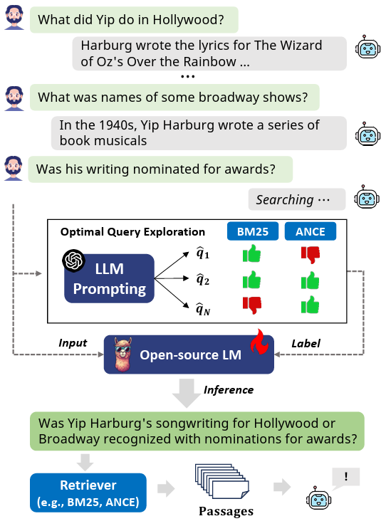

# RetPO

Official implementation of "[Ask Optimal Questions: Aligning Large Language Models with Retriever’sPreference](https://arxiv.org/abs/2402.11827)". <br>

> [Chanwoong Yoon<sup>1*</sup>](https://scholar.google.com/citations?user=-9GfY0AAAAAJ&hl=en), [Gangwoo Kim<sup>1*</sup>](https://scholar.google.com/citations?user=TmWGEFgAAAAJ&hl=en), [Byeongguk Jeon<sup>1</sup>](https://scholar.google.com/citations?user=_Kw32VoAAAAJ&hl=en), [Sungdong Kim<sup>2,3</sup>](https://scholar.google.com/citations?user=xKrSnDoAAAAJ&hl=en), [Yohan Jo<sup>4</sup>](https://scholar.google.com/citations?user=xp3LGRQAAAAJ&hl=en), [Jaewoo Kang<sup>1</sup>](https://scholar.google.co.kr/citations?user=RaBZafQAAAAJ&hl=en)<br>
> Korea University<sup>1</sup>, NAVER Cloud<sup>2</sup>, KAIST AI<sup>3</sup>, Seoul National University<sup>4</sup> <br>
> In NAACL 2025.


<p align="center">
    
</p>

<p align="center">
    📃 <a href="https://arxiv.org/abs/2402.11827" target="_blank">Paper</a> | 🤗 <a href="" target="_blank">Model</a> | 🤗 <a href="https://huggingface.co/datasets/dmis-lab/RF-Collection" target="_blank">RF-Collection</a>
</p>

> **Abstract** Conversational search, unlike single-turn retrieval tasks, requires understanding the current question within a dialogue context. The common approach of rewrite-then-retrieve aims to decontextualize questions to be self-sufficient for off-the-shelf retrievers, but most existing methods produce sub-optimal query rewrites due to the limited ability to incorporate signals from the retrieval results. To overcome this limitation, we present a novel framework RetPO (Retriever's Preference Optimization), which is designed to optimize a language model (LM) for reformulating search queries in line with the preferences of the target retrieval systems. The process begins by prompting a large LM to produce various potential rewrites and then collects retrieval performance for these rewrites as the retrievers' preferences. Through the process, we construct a large-scale dataset called RF collection, containing Retrievers' Feedback on over 410K query rewrites across 12K conversations. Furthermore, we fine-tune a smaller LM using this dataset to align it with the retrievers' preferences as feedback. The resulting model demonstrates superiority on two benchmarks, surpassing the previous state-of-the-art performance of rewrite-then-retrieve approaches, including GPT-3.5.

## Content
1. Environment
2. Dataset Preparation
- TopiOCQA, QReCC, CAST-19, CAST-20
- LLM Prompting
3. Retriever Indexing (BM25, ANCE)
- Document preprocessing (tokenization)
- Document Embedding
4. Collect Retriever's Preferences (Retriever evaluation)
- CPU, GPU search
- assign rank
4. Training & Inference
- construct binarized preference sets
- SFT, DPO

## 1. Installation Instructions
Please be aware that we utilize two distinct environments.
1. retpo_search (retriever indexing and search)
2. retpo_qr (QR model training and inference)
> The base retrieval code uses faiss-gpu, which is tied to specific versions of CUDA and torch. If the versions do not match, errors may occur. Therefore, we use separate environments.

### retpo_search
As we require a lot of retrieval of dense retriever, we recommend to consider to use faiss-gpu.
```bash
# create environment
conda create -n retpo python==3.9 && conda activate retpo_search

# torch
pip install torch==1.12.0+cu116 torchvision==0.13.0+cu116 torchaudio==0.12.0 --extra-index-url https://download.pytorch.org/whl/cu116

# faiss-cpu or faiss-gpu
# CPU
pip install faiss-cpu==1.7.3
# GPU
pip install https://github.com/kyamagu/faiss-wheels/releases/download/v1.7.3/faiss_gpu-1.7.3-cp39-cp39-manylinux_2_17_x86_64.manylinux2014_x86_64.whl

# other requirements
cd RetPO
pip install -r requirements.txt

```

### retpo_qr
```bash
# create environment
cd retpo_qr/
conda create -n retpo_qr python=3.10 && conda activate retpo_qr

# install torch
pip install torch==2.1.0 # this specific version is crucial for reproducibility. you may need to install other variants based on your hardware.

# install dependencies
python -m pip install .

# Flash Attention 2 (Optional, but Recommended for Faster Training)
# If your machine has less than 96GB of RAM and many CPU cores, reduce MAX_JOBS, e.g.:
python -m pip install flash-attn --no-build-isolation
```

## 2. Evaluation

### Preparation
We mainly evaluate our method using two types of retrievers: BM25 and <a href="https://github.com/microsoft/ANCE" target="_blank">ANCE</a> on two Conversational QA benchmarks: <a href="https://github.com/McGill-NLP/topiocqa" target="_blank">TopiOCQA</a> and <a href="https://github.com/apple/ml-qrecc" target="_blank">QReCC</a>.

There are well-organized repositories for preprocessing these datasets and indexing passages for retrieval. We recommend using them before running our code. We mainly refer to the <a href="https://github.com/fengranMark/ConvGQR" target="_blank">_ConvGQR_</a> as a reference.

Specifically, to run our code, you need to prepare following files.

> You can find the code to prepare these folders here:  
> pyserini_index/ # https://github.com/fengranMark/ConvGQR/blob/main/bm25/create_index.sh  
> tokenized/ # https://github.com/fengranMark/ConvGQR/blob/main/gen_tokenized_doc.py  
> embeddings/ # https://github.com/fengranMark/ConvGQR/blob/main/gen_doc_embeddings.py  

```bash
ROOT_DIR/
└── datasets/
    └── checkpoints # Retriever checkpoints
        └── ad-hoc-ance-msmarco # https://huggingface.co/3ricL/ad-hoc-ance-msmarco
    └── topiocqa/
        ├── pyserini_index/
        ├── full_wiki_segments.tsv
        ├── tokenized/
        ├── embeddings/
    └── qrecc/
        ├── pyserini_index/ 
        ├── full_wiki_segments.tsv
        ├── tokenized/
        ├── embeddings/

```

### Reproduce our performance
For those who'd like to reproduce our reported performance, you can download our queries generated by RetPO from [this Google Drive](https://drive.google.com/drive/folders/1YyXpzb8QXjaKajI1kNKywAn3ZZtSGCDe?usp=drive_link). (Place it in the ```ROOT_DIR/distill_outputs``` of the repository.)

You can reproduce our main performance by running the following command.
```bash
cd eval
bash ./scripts/bm25_topiocqa.sh
```

## 3. RetPO (Retriever's Preference Optimization) 

### Download RF-Collection
We construct a large-scale dataset called RF-COLLECTION, containing Retrievers’ Feedback on over 410K query rewrites across 12K conversations.
You can download it from [RF-Collection](https://huggingface.co/datasets/dmis-lab/RF-Collection) using the following command.
```python
from datasets import load_dataset

ds = load_dataset("dmis-lab/RF-Collection", cache_dir="{ROOT_DIR}/retpo_qr/")
```
<!-- 
### Running the Model

Set corresponding environment variables first. <br>
For $TRAIN_DATA, please set `train.json` for orconvqa or `train_filtered.json` for qrecc (only using examples including gt passages) <br>
Or you can define another dataset containing hard negatives after mining them. e.g., `train_negs.json` or `train_filtered_negs.json` <br>

```
export DATA_PATH=preprocessed
export OUTPUT_PATH=outputs
export N_GPU=$N_GPU
export TRAIN_DATA=$TRAIN_DATA
```

```
python3 ddp_launcher.py \
  --data_path $DATA_PATH \
  --output_path $OUTPUT_PATH \
  --task $TASK \
  --model_name_or_path facebook/dpr-question_encoder-single-nq-base \
  --train_data $TRAIN_DATA \
  --dev_data dev.json \
  --test_data test.json \
  --train_batch_size 128 \
  --eval_batch_size 256 \
  --num_train_epochs 10 \
  --index_batch_size 512 \
  --learning_rate 3e-5 \
  --weight_decay 0.1 \
  --num_warmup_steps 0 \
  --n_hard_negative 0 \
  --top_k 100 \
  --max_buffer_size 1574824 \
  --do_predict
```

If you include "--do_predict" argument, resulting outputs of the evaluation will be located in $OUTPUT_PATH. <br>
(WANRNING!) The indexing and retrieval for the inference take much time according to its whole passage collection size. <br>
In other word, QReCC, which has about 50M passages, requires lots of time and memory consumptions. <br>
We will add ANN search to increase the retrieval speed in the very soon.

* index_(dev|test).faiss : FAISS index file. It requires 30-160GB of storage.
* (dev|test)_eval_result.json: evaluation result including MRR and Recall@k
* (dev|test)_eval_scores.json: top-k relevance scores for each query
* (dev|test)_eval_incices.json: top-k indices for each query

In the case of QReCC, the overall result could be evaluated based on question types. <br>
For this, please run the below script.

`$ python3 eval_breakdown.py --result_data_file $OUTPUT_PATH/test_eval_scores.json --data_path $DATA_PATH`

```
trec 371
{'MRR': 0.32469379627601447, 'Recall@5': 0.4474393530997305, 'Recall@10': 0.555256064690027, 'Recall@20': 0.6531895777178797, 'Recall@100': 0.8045822102425876}

quac 6396
{'MRR': 0.5424993382858436, 'Recall@5': 0.6970137137211299, 'Recall@10': 0.7789605586634041, 'Recall@20': 0.8246712239580937, 'Recall@100': 0.8872222779071794}

nq 1442
{'MRR': 0.5268851536713797, 'Recall@5': 0.6412327583120463, 'Recall@10': 0.7337462549009012, 'Recall@20': 0.7976587435013233, 'Recall@100': 0.8827564813313773}

no-switch 279
{'MRR': 0.7206635174177008, 'Recall@5': 0.8315113500597372, 'Recall@10': 0.8806650736758264, 'Recall@20': 0.9111509358821187, 'Recall@100': 0.9414177618478694}

switch 573
{'MRR': 0.3969942310926863, 'Recall@5': 0.52380653959188, 'Recall@10': 0.629972084343812, 'Recall@20': 0.7156843553963973, 'Recall@100': 0.8406293425403373}

first 267
{'MRR': 0.4818849831007729, 'Recall@5': 0.5770911360799, 'Recall@10': 0.7091136079900124, 'Recall@20': 0.7649812734082397, 'Recall@100': 0.8707865168539326}

all 8209
{'MRR': 0.5299129684113517, 'Recall@5': 0.6759358448588522, 'Recall@10': 0.7609080074038533, 'Recall@20': 0.8121761956265329, 'Recall@100': 0.8827029523174765}
```


### Mining Hard Negative

It outputs `$split_negs.json` and you should specify it for `$TRAIN_DATA` of retriever training.

**Model-Negs**

Model-based hard negative mining. It utilizes already finetuned vanilla DPR from the first stage. <br>

```
export DATA_PATH=preprocessed
export OUTPUT_PATH=$OUTPUT_PATH # checkpoint of already finetuned vanilla DPR

python3 build_dense_negatives.py \
  --task $TASK
  --data_path $DATA_PATH \
  --split train \
  --output_path $DATA_PATH \
  --model_name_or_path $OUTPUT_PATH \
  --index_batch_size 1024 \
  --top_k 100 \
  --iteration 1 \
```

The resulting file will be `$OUTPUT_PATH/train_negs.json`.

**BM25-Negs**

```
export DATA_PATH=dataset
export OUTPUT_PATH=preprocessed

python3 build_bm25_negatives.py \
  --task $TASK \
  --split train \
  --read_by all \
  --raw_data_path $DATA_PATH \
  --preprocessed_data_path $OUTPUT_PATH \
  --pyserini_index_path $OUTPUT_PATH/$TASK/pyserini_index \
  --top_k 100
```

The resulting file will be `$OUTPUT_PATH/$TASK/train_bm25_negs.json`.

**CQR-Negs**

First, preprocess the corresponding dataset by using `--use_rewrite_only` argument.

```
export DATA_PATH=dataset
export OUTPUT_PATH=preprocessed

python3 data_preprocessing.py \
  --task $TASK \
  --suffix rewrite \
  --data_path $DATA_PATH \
  --output_path $OUTPUT_PATH \
  --max_query_length 128 \
  --max_passage_length 384 \
  --pyserini_index_path $DATA_PATH/$TASK/pyserini_index \
  --use_rewrite_only
```

Then,

```
export DATA_PATH=preprocessed
export OUTPUT_PATH=rewrite_negative

python3 build_dense_negatives.py \
  --task $TASK
  --data_path $DATA_PATH \
  --split train_rewrite \
  --output_path $DATA_PATH \
  --model_name_or_path $OUTPUT_PATH \
  --index_batch_size 1024 \
  --top_k 100 \
  --iteration 1 \
```

The resulting file will be `$OUTPUT_PATH/train_rewrite_negs.json`.

## Playing with pretrained model from Huggingface Models

```python
import json
import torch
from transformers import DPRContextEncoder, DPRQuestionEncoder, AutoTokenizer
from utils.conv_tokenizer import ConvTokenizer

q_encoder = DPRQuestionEncoder.from_pretrained("dsksd/dpr-question_encoder-single-qrecc-model-base")
ctx_encoder = DPRContextEncoder.from_pretrained("dsksd/dpr-ctx_encoder-single-qrecc-model-base")

tokenizer = AutoTokenizer.from_pretrained("dsksd/dpr-question_encoder-single-qrecc-model-base")
conv_tokenizer = ConvTokenizer(tokenizer)

conversation = [
    "Who played the first game of the 2018 world cup?",
    "Russia and Saudi played the opening match.",
    "Which team won?"
]

passages = json.load(open("assets/example_passages.json", "r", encoding="utf-8"))

q_inputs = conv_tokenizer(
      [conversation],
      max_length=128,
      padding="max_length", # max_length or longest
      truncation=True, # no other option here, (truncation from left-side)
      retain_first_utter=True, # it retains first utterance when True
      turn_delim_token=tokenizer.sep_token, # add delimiter token between utterance
      return_tensors="pt"
)

ctx_inputs = tokenizer(passages, max_length=384, padding="max_length", truncation=True, return_tensors="pt")

with torch.no_grad():
    q_vec = q_encoder(**q_inputs)
    ctx_vec = ctx_encoder(**ctx_inputs)
    
    score = torch.matmul(ctx_vec[0], q_vec[0].transpose(0, 1)).squeeze()
    _, idx = score.topk(3, 0)  # top-3

for i in idx:
    print(passages[i])

>>> how russia beat saudi arabia in the world cup opener - ... **2018 russia comprehensively thrashed saudi arabia**, 5 - 0, ...
``` -->

## Citation


```bibtex
@article{yoon2024ask,
  title={Ask Optimal Questions: Aligning Large Language Models with Retriever's Preference in Conversational Search},
  author={Yoon, Chanwoong and Kim, Gangwoo and Jeon, Byeongguk and Kim, Sungdong and Jo, Yohan and Kang, Jaewoo},
  journal={arXiv preprint arXiv:2402.11827},
  year={2024}
}
```

## Contact
For more information or any questions of our work, feel free to contact me (cwyoon99 (at) korea.ac.kr or gmail.com). 